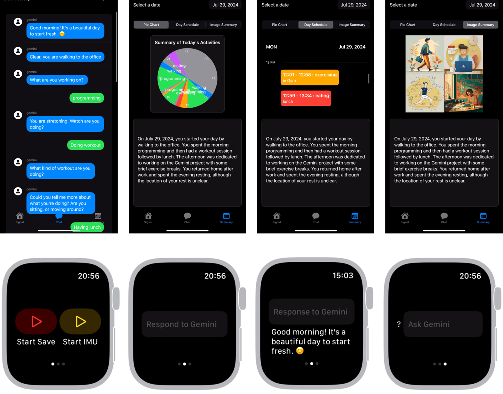

# LifeLinkAI

LifeLinkAI is an iOS application utilizing Firebase for storage, real-time database, authentication, and Firestore database functionalities. This project is built using SwiftUI and includes a Watch App companion.

## Table of ContentsMore actions
- [Features](#features)
- [Installation](#installation)
- [Firebase Setup](#firebase-setup)
- [iOS Setup](#ios-setup)
- [Usage](#usage)

## Features

- Firebase Authentication (Email/Password)
- Firebase Realtime Database
- Firebase Firestore Database
- Firebase Storage
- SwiftUI-based iOS App
- Watch App companion
