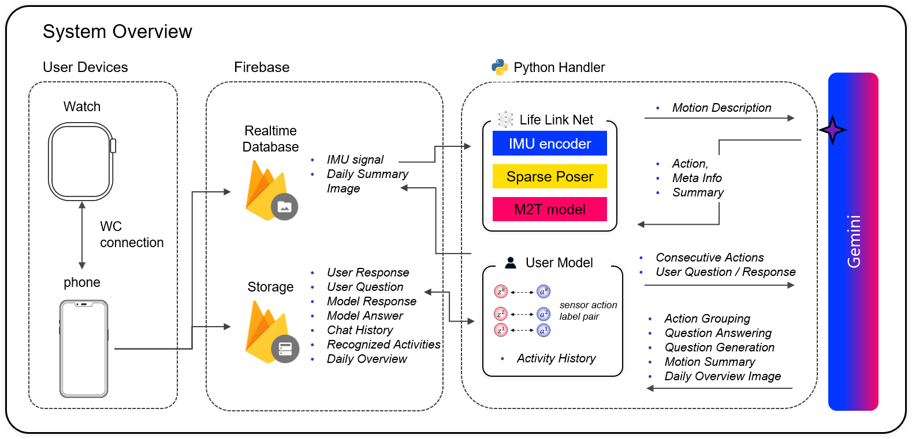
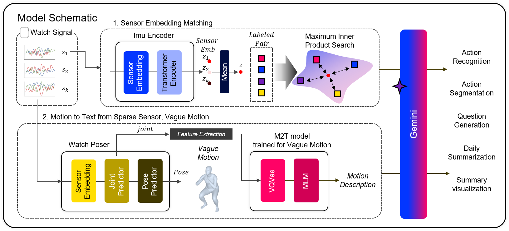

# LifeLinkAI Python Server


This README provides instructions for setting up and running the LifeLinkAI Python server. The server integrates with Firebase and Google APIs to process data and generate insights.

## Table of Contents

- [Setup](#setup)
  - [Firebase Admin SDK](#firebase-admin-sdk)
  - [Environment Variables](#environment-variables)
  - [Dependencies](#dependencies)
- [Running the Handler](#running-the-handler)
- [Model Descriptions](#model-descriptions)

## Setup

### Firebase Admin SDK

1. **Generate Firebase Admin SDK Private Key**
   - Go to Firebase project settings → Service accounts
   - Generate a new private key for Python
   - Save the key file to the `authentication/` folder

### Environment Variables

Create a `.env` file in the root directory of the project with the following variables:

```plaintext
SERVICE_ACCOUNT_KEY_PATH=authentication/your_private_key_file.json
STORAGE_BUCKET=your_storage_bucket_url
DATABASE_URL=your_database_url
GEMINI_API_KEY=your_gemini_api_key

DOWNLOAD_FOLDER=download_data
PARSE_FOLDER=parsed_data
```
Generate the Gemini API key from [Gemini API Key Generation](https://aistudio.google.com/app/apikey) and update the GEMINI_API_KEY.
 

## Dependencies
1. Conda Environment
```bash
conda create -n lifelinkai python==3.10
conda activate lifelinkai
```

2. Install Required Python Packages
```bash
pip install python-dotenv pyyaml schedule firebase-admin transformers scipy google-generativeai
```

3. Install PyTorch
Follow the instructions at [PyTorch.org](https://pytorch.org/get-started/locally/) to install PyTorch based on your system configuration.

4. Download Models
```bash
bash prepare/prepare_t5.sh
```
or manually:
```bash
cd model/vmGpt/deps
git lfs install
git clone https://huggingface.co/google/flan-t5-base
```
5. Download Pretrained Model
Download model_log folder from [google_drive](https://drive.google.com/drive/folders/1_vGg8MtB8ZGIyeM4udXt6K5TSnqrZ6Vw?usp=drive_link)

(Optional) 6. Try sample paired data
Sample paired data "sample_paired_data.pkl" having "walking", "eating" and "working" is in [google_drive](https://drive.google.com/drive/folders/1_vGg8MtB8ZGIyeM4udXt6K5TSnqrZ6Vw?usp=drive_link), you can download paired data and rename it as paired_data_{user_id}.pkl to allow models to more easily recognize basic activities. 

## Running the Handler
To start the server, run:
```bash
python start_lifelink.py
```

## Image Generation
1. Install Google Cloud AI Platform
```bash
pip install google-cloud-aiplatform
```
2. Initialize Google Cloud SDK
Follow the instructions at [Google Cloud SDK](https://cloud.google.com/sdk/docs/install-sdk) to initialize the SDK for using Vertex AI on a local server.




## Model Descriptions
1. Initial Embedding: When a new sensor signal arrives, it is first processed by the sensor signal encoder to generate an embedding.
2. Label Comparison: If labeled pairs of previous sensor signals and corresponding action metadata exist, the model compares the new embedding with these previous embeddings. If a close match is found, the system quickly identifies the current motion based on the predefined threshold of similarity and embedding timestamp. Depending on the similarity and the context, the system decides whether to ask the user for more information or to accept the existing metadata.
3. Sparse Poser Decoding: If no matching label pair is found, the sparse poser decodes the signal to predict the user's body motion.
4. Motion Description Generation: The vague motion data is processed by the Motion to Text model, generating a natural language description of the current motion. This description is then passed to the Gemini model to extract detailed action categories and metadata such as destinations.
5. Grouping and Summarization: When multiple consecutive signal chunks are processed, their descriptions are grouped by the Gemini model based on linguistic similarities. This ensures a cohesive summary of the user's activities over time

