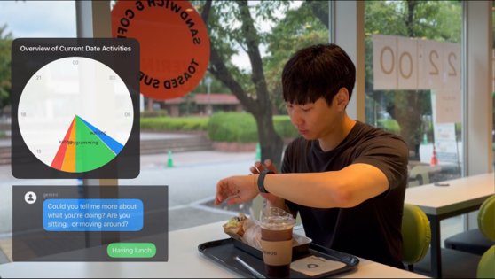

***
Add commentMore actions

  <i>Gemini API Developer Competition</i>  
  <i>#BuildWithGemini</i>  

 

<h2 align="center">
   
  ⭐️ Life Link AI ⭐
   
</h2>

# LifeLinkAI

## Project Video [Video](https://drive.google.com/file/d/1IbeEEVIf_g99SceXCT5N6sMR7o7aex0n/view?usp=drive_link)

LifeLinkAI is a comprehensive project consisting of an iOS application and a Python server. The project leverages Firebase for data storage, real-time database functionalities, authentication, and Firestore database capabilities. The Python server processes data and generates insights using machine learning models.

## Table of Contents

- [Project Overview](#project-overview)
- [Features](#features)
- [Directories](#directories)
  - [iOS App](#ios-app)
  - [Python Server](#python-server)
  

## Project Overview

Time flies, and we often lose track of our daily activities. Keeping a daily diary is cumbersome, making automatic recognition essential. LifeLinkAI provides a solution with seamless AI interaction through motion.

LifeLinkAI is a cutting-edge app designed to effortlessly capture and summarize your daily life using motion sensors in your smartwatch. Our innovative app offers a range of functionalities to ensure you never miss a moment.

## Features

1. **Seamless Motion Capture:** LifeLinkAI captures your movements using sparse motion sensors in your smartwatch. Our advanced motion-to-text model, trained with a vast dataset of motion and text pairs, transforms these vague motions into natural language descriptions.
2. **Intelligent Activity Recognition:** Leveraging the reasoning capabilities of the Gemini large language model, LifeLinkAI accurately identifies your current activities and their metadata. Similar activities are grouped together, providing a cohesive overview of your day.
3. **User-Friendly Labeling:** Users can easily label current sensor signals with their voice. When similar signals are detected, LifeLinkAI recognizes and applies the previously provided labels, ensuring consistent and even improving activity tracking. If an activity is unclear, the app prompts you for clarification, facilitating natural interaction through voice, language, and motion.
4. **Comprehensive Activity Overview:** All recorded activities are displayed in a timetable and calendar format, allowing you to clearly see your daily accomplishments. Additionally, a summarized text provides an overall view of your day's activities.

With LifeLinkAI, effortlessly track, understand, and reflect on your daily life. Download now and start your journey towards a more organized and insightful life.

## Directories

### iOS App

The iOS application code is located in the `LifeLinkAI` directory. Follow the instructions in the [iOS README](./LifeLinkAI/README.md) to set up and run the iOS application.

- **Path:** `LifeLinkAI/`
- **Setup Instructions:** [iOS README](./LifeLinkAI/README.md)

### Python Server

The Python server code is located in the `LifeLinkAI-Server` directory. Follow the instructions in the [Server README](./LifeLinkAI-Server/README.md) to set up and run the Python server.

- **Path:** `LifeLinkAIPython/`
- **Setup Instructions:** [Server README](./LifeLinkAIPython/README.md)
