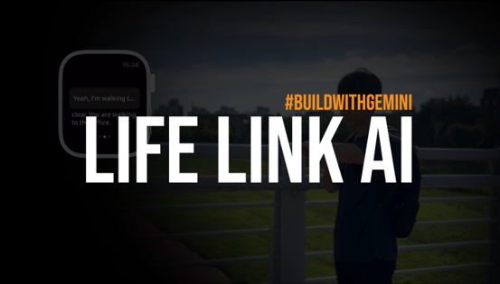

***

  <i>Gemini API Developer Competition</i>  
  <i>#BuildWithGemini</i>  

<h2 align="center">
   
  ⭐️ Life Link AI ⭐
   
</h2>
# LifeLinkAI
  Sensor - Motion - Text  

Life Link AI is a cutting-edge app designed to capture motion and to generate text.

## Project Overview

## Features

1. **Seamless Motion Capture:** LifeLinkAI captures your movements using sparse motion sensors in your smartwatch. Our advanced motion-to-text model, trained with a vast dataset of motion and text pairs, transforms these vague motions into natural language descriptions.
2. **Intelligent Activity Recognition:** Leveraging the reasoning capabilities of the Gemini large language model, LifeLinkAI accurately identifies your current activities and their metadata. Similar activities are grouped together, providing a cohesive overview of your day.
3. **User-Friendly Labeling:** Users can easily label current sensor signals with their voice. When similar signals are detected, LifeLinkAI recognizes and applies the previously provided labels, ensuring consistent and even improving activity tracking. If an activity is unclear, the app prompts you for clarification, facilitating natural interaction through voice, language, and motion.

## Directories

## Project Video [Video](https://drive.google.com/file/d/1IbeEEVIf_g99SceXCT5N6sMR7o7aex0n/view?usp=drive_link)

### Python Server

The Python server code is located in the `LifeLinkAIPython` directory. Follow the instructions in the [Server README](./LifeLinkAIPython/README.md) to set up and run the Python server.

- **Path:** `LifeLinkAIPython/`
- **Setup Instructions:** [Server README](./LifeLinkAIPython/README.md)

